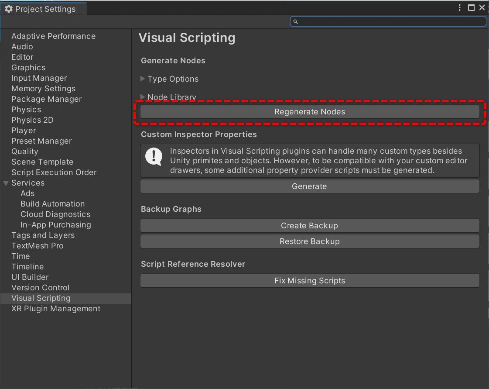
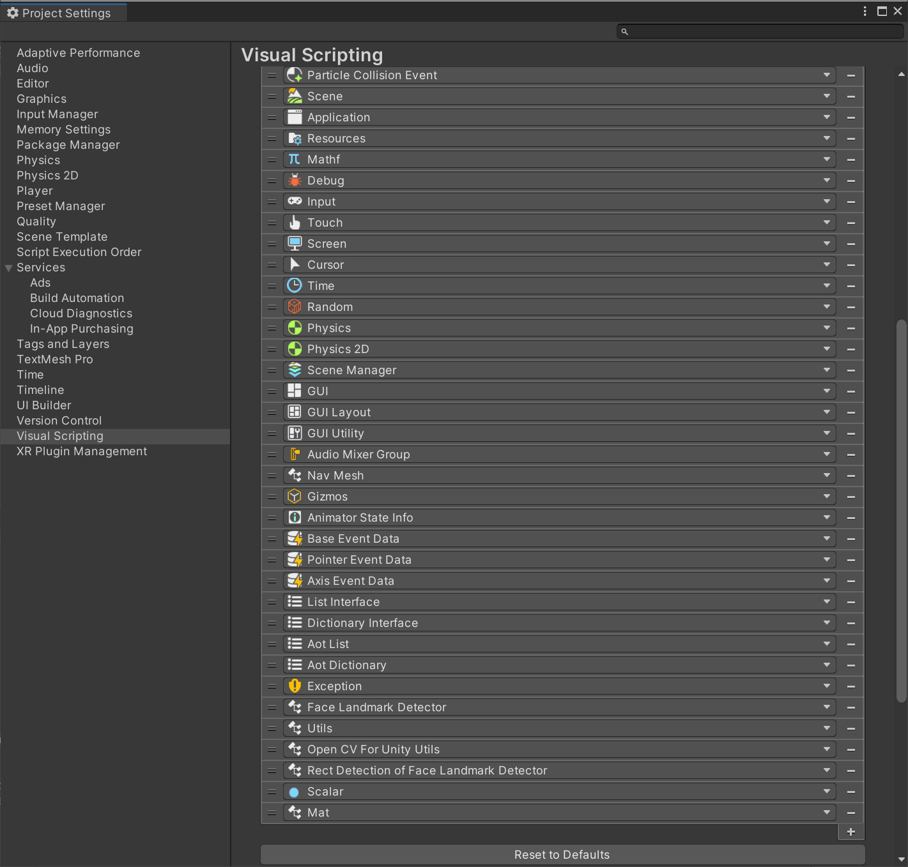
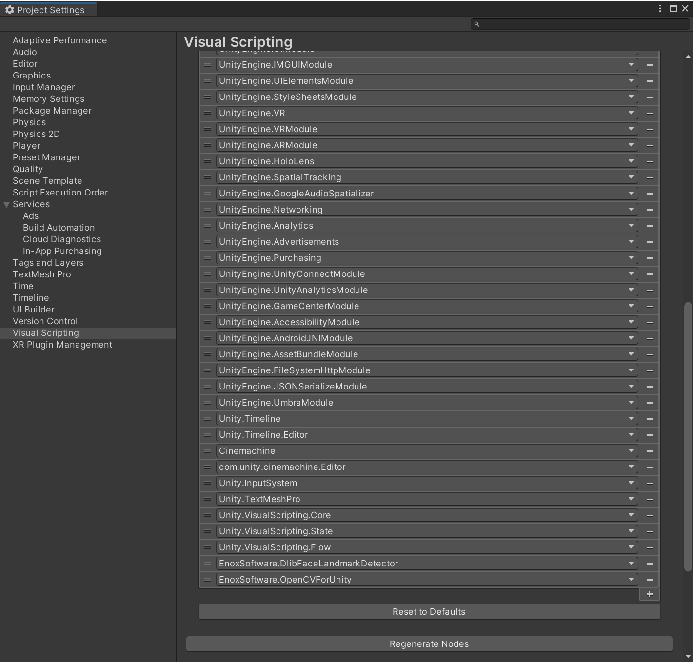
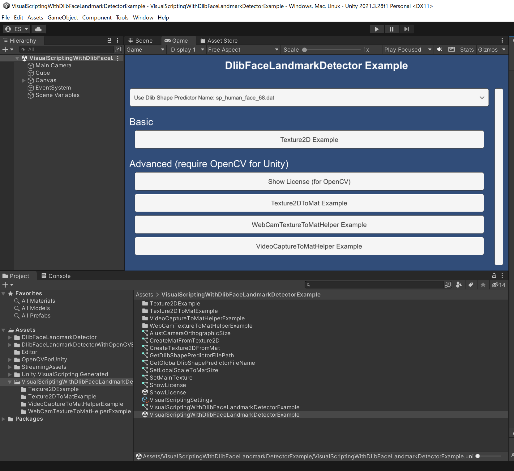
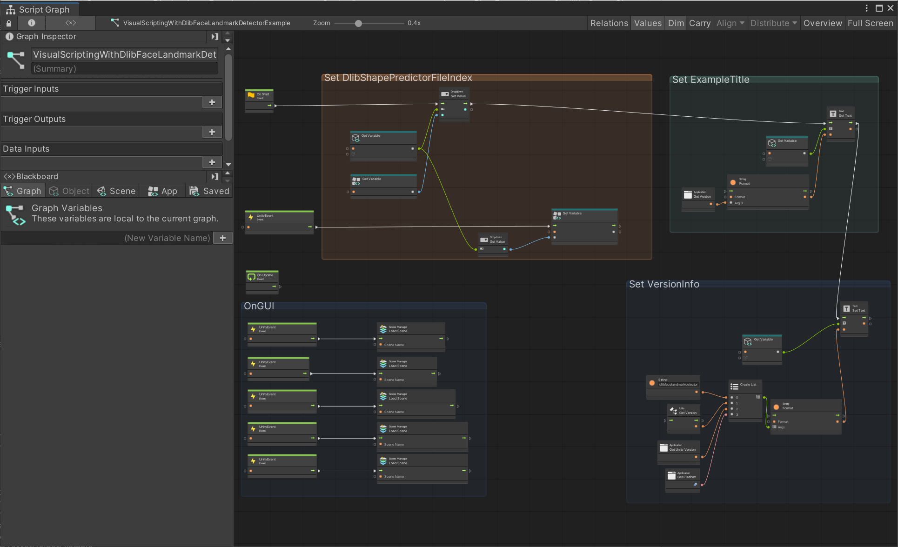
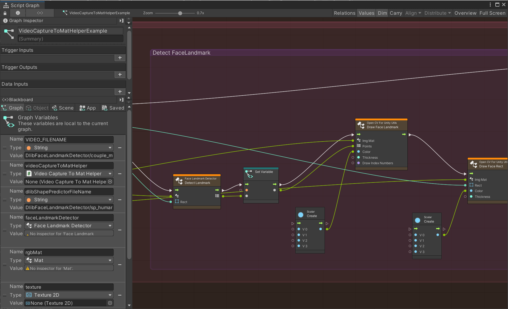

# VisualScripting With DlibFaceLandmarkDetector Example

## Overview

- Integrates **[Visual Scripting](https://docs.unity3d.com/Manual/com.unity.visualscripting.html)** with **[Dlib FaceLandmarkDetector](https://assetstore.unity.com/packages/tools/integration/dlib-facelandmark-detector-64314?aid=1011l4ehR)** and **[OpenCV for Unity](https://assetstore.unity.com/packages/tools/integration/opencv-for-unity-21088?aid=1011l4ehR)** for node-based face landmark detection.

## Environment

- **Unity 2021.3.45f2+**
- [Dlib FaceLandmarkDetector](https://assetstore.unity.com/packages/tools/integration/dlib-facelandmark-detector-64314?aid=1011l4ehR) **2.0.1+**
- [OpenCV for Unity](https://assetstore.unity.com/packages/tools/integration/opencv-for-unity-21088?aid=1011l4ehR) **3.0.2+**
- **Visual Scripting 1.9.10**

## Setup

1. Download the latest release unitypackage from [VisualScriptingWithDlibFaceLandmarkDetectorExample.unitypackage](https://github.com/EnoxSoftware/VisualScriptingWithDlibFaceLandmarkDetectorExample/releases).
2. Create a new project. *(ex. VisualScriptingWithDlibFaceLandmarkDetectorExample)*
3. Import and Setup [OpenCV for Unity](https://assetstore.unity.com/packages/tools/integration/opencv-for-unity-21088?aid=1011l4ehR).
4. Import [Dlib FaceLandmarkDetector](https://assetstore.unity.com/packages/tools/integration/dlib-facelandmark-detector-64314?aid=1011l4ehR).
   - Select Menu Item `Tools > OpenCV for Unity > Open Setup Tools`.
   - Click the `Move StreamingAssets Folder` button.
   - Click the `Import OpenCV Example Package` button.
5. Import [VisualScriptingWithDlibFaceLandmarkDetectorExample.unitypackage](https://github.com/EnoxSoftware/VisualScriptingWithDlibFaceLandmarkDetectorExample/releases).
6. Replace `Assets/VisualScriptingWithDlibFaceLandmarkDetectorExample/VisualScriptingSettings.asset` with `ProjectSettings/VisualScriptingSettings.asset`.
7. Open `Project Settings` > `Visual Scripting` > `Regenerate Units`
    
    
    
    

## ScreenShot

