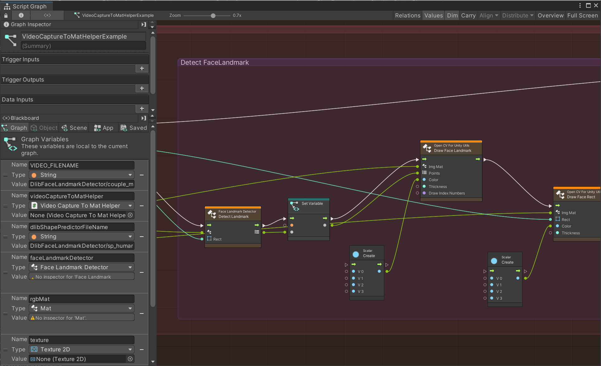

# VisualScripting With DlibFaceLandmarkDetector Example

## Overview

## Environment
* Unity 2021.3.28f1
* [Dlib FaceLandmarkDetector](https://assetstore.unity.com/packages/tools/integration/dlib-facelandmark-detector-64314?aid=1011l4ehR) 1.3.4+
* [OpenCV for Unity](https://assetstore.unity.com/packages/tools/integration/opencv-for-unity-21088?aid=1011l4ehR) 2.5.5+
* Visual Scripting 1.8.0

## Setup
1. Download the latest release unitypackage. [VisualScriptingWithDlibFaceLandmarkDetectorExample.unitypackage](https://github.com/EnoxSoftware/VisualScriptingWithDlibFaceLandmarkDetectorExample/releases)
1. Create a new project.
1. Import the OpenCVForUnity.
1. Import the DlibFaceLandmarkDetector.
    * Select MenuItem[Tools/OpenCV for Unity/Open Setup Tools].
    * Click the [Move StreamingAssets Folder] button.
    * Click the [Import OpenCV Example Package] button.
1. Import the VisualScriptingWithOpenCVForUnityExample.unitypackage.
1. Replace "Assets/VisualScriptingWithDlibFaceLandmarkDetectorExample/VisualScriptingSettings.asset" to "ProjectSettings/VisualScriptingSettings.asset".
1. Project Settings > Visual Scripting > Regenerate Units

## ScreenShot
 

